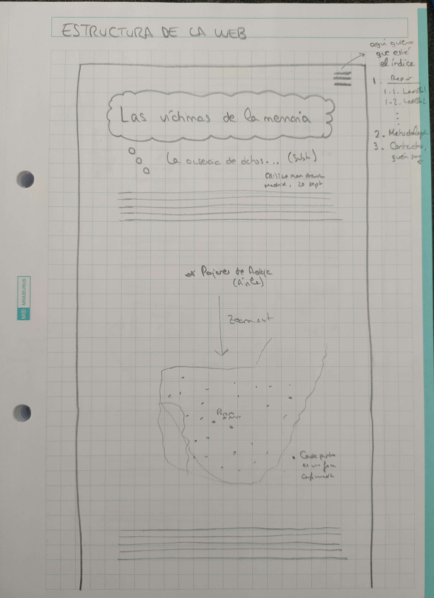
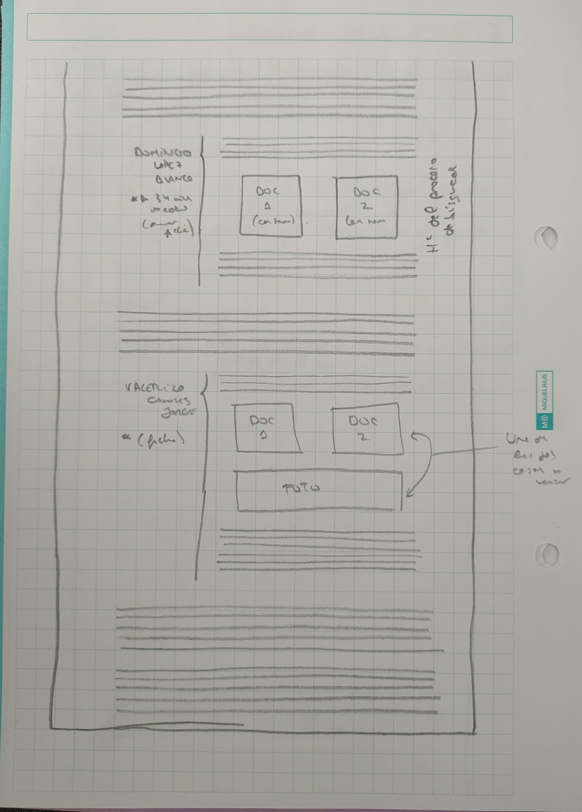

# Memoria del Trabajo Fin del Máster en Periodismo y Visualización de Datos (MPVD) *Las víctimas de la memoria*
Alumna: Cristina Alonso Pascual 
DNI: 45690520P 
Tutores: María Zuil y Adolfo Antón Bravo  
Curso: 2022-2023 
Universidad de Alcalá (UAH) 

---

**Agradecimientos**:

Este trabajo no hubiera sido posible sin las enseñanzas del profesorado del Máster en Periodismo y Visualización de Datos (MPVD), con especial mención a Adolfo Antón Bravo, siempre preocupado por nuestro trabajo y a disposición de nuestras consultas, y a María Zuil, que se ha encargado de revisar mi trabajo y a la que admiro desde hace tiempo por tratarse de una gran profesional, siempre dispuesta también a echar una mano.

En lo personal, quiero agradecer a mi familia por estar ahí. En especial, a mi madre y a mi padre, por apoyarme durante el proceso de realización del TFM y a lo largo de todo el máster, y estar ahí para animarme cuando era necesario. También me gustaría agradecer a mis amigos, quienes, en los momentos de crisis -grandes o pequeñas-, me acompañaron y me hicieron salir adelante y confiar.

Y, por supuesto, agradecer a las personas que han participado en este TFM por dedicarme su tiempo, lo más valioso que se puede ofrecer a alguien, y que han hecho que ahora pueda contar un pedacito de su historia, nuestra historia.

---

**Resumen**:

Los descendientes de las víctimas de la guerra civil española y la dictadura franquista exponen los obstáculos a la hora de encontrar a sus familiares, pese a que han pasado 87 años desde el inicio de la Guerra Civil. Pese a la ley de memoria democrática de 2022, aún es complicado acceder a numerosos documentos de esa época. Afectados y expertos en memoria intentan explicar cómo hacen frente a estas dificultades en su investigación y dan su opinión sobre las consecuencias que tiene la falta de información de ese período sobre la sociedad actual.

**Palabras clave**: memoria histórica, memoria democrática, guerra civil, franquismo, recopilación de datos

**Abstract**:

Some descendants of Spanish Civil War and Franco's regime victims talk about the obstacles found when they started to look for information about their relatives. Despite the fact that 87 years have passed since the start of the Civil War and that the Government has created a law of democratic memory in 2022, it is still difficult to access documents from that period. The descendants and experts on historical memory try to explain how they have dealt with these obstacles during their research. Furthermore, they give their opinion on the consequences that the lack of information about that period has on nowadays' society.

**Keywords**: historical memory, democratic heritage, Spanish Civil War, Francoist dictatorship, data compilation

**Enlace a la página web del reportaje**: [Las víctimas de la memoria](https://mpvdes.github.io/2022-2023-tfm-crisalpas/)

**Enlace al repositorio de GitHub**: [2022-2023-tfm-crisalpas](https://github.com/mpvdes/2022-2023-tfm-crisalpas)

## 1. Introducción

La importancia de la memoria para el ser humano ha marcado la historia y la evolución de la humanidad. Esta relevancia queda patente a través de proyectos como *Memory of the World*, de la Organización de las Naciones Unidas para la Educación, la Ciencia y la Cultura [(UNESCO)](https://www.unesco.org/en/memory-world), que busca preservar la memoria documental y facilitar el acceso a la misma.

Sin embargo, esta práctica no es habitual en todas las ocasiones y existen momentos de la historia en los que es difícil acceder a toda la documentación, ya sea por falta de archivos, desinterés de la administración o de la población, o, incluso, intención directa de olvidar o de ocultar algunos datos con distintas finalidades.

En ese contexto surge este Trabajo Fin de Máster, cuando descubro que desconozco detalles sobre el pasado reciente del país en el que nací y resido, España. Es en el momento en el que acudo al Valle de Cuelgamuros -entonces llamado Valle de los Caídos- junto a algunos amigos de otros países cuando me doy cuenta de que allí falta información, la cual yo misma soy incapaz de completar ante mis compañeros cuando quiero explicarles qué pasó allí, pese a haberme formado en España.

De esta forma, el Trabajo Fin de Máster que aquí se encuentra resumido nace con objeto de descubrir los impactos que tiene sobre una sociedad la falta de información y de datos accesibles sobre su historia, en especial si es reciente y si una parte de su población considera que aún quedan ciertas heridas sin cerrar. 

## 2. Estado de la cuestión

Si bien a lo largo de los últimos años se han hecho avances en pos de la memoria democrática, como la Ley 20/2022, de 19 de octubre, de Memoria Democrática publicada en el Boletín Oficial del Estado [(BOE)](https://www.boe.es/eli/es/l/2022/10/19/20/con), el fin del franquismo con la muerte del dictador Francisco Franco en 1975 no vino acompañado de una reparación o de un proceso judicial a quienes participaron en la represión durante los casi cuarenta años de dictadura, como sí ocurrió, por ejemplo, en Argentina, con el [Juicio a las Juntas](https://www.argentina.gob.ar/noticias/juicio-las-juntas-la-primera-condena-al-terrorismo-de-estado) de diciembre de 1985.

Así, el Gobierno de España ha iniciado finalmente la conversación sobre la memoria democrática a través de del cambio de nombre del Ministerio de la Presidencia, Relaciones con las Cortes y Memoria Democrática [(MPR)](https://www.mpr.gob.es/memoriademocratica/Paginas/index.aspx) y la inclusión de la Secretaría de Estado de Memoria Democrática. También ciertos medios de comunicación han creado secciones al respecto, como eldiario.es, que ha elegido [este tema](https://www.eldiario.es/focos/memoria_historica/) como uno de los "focos" del periódico.

Sin embargo, no existen numerosos artículos que analicen la dificultad de acceso a la información en memoria democrática -*Público* publicó el 31 de agosto de 2022 una pieza enfocada en ["La oscura realidad de los archivos militares en España"](https://www.publico.es/politica/oscura-realidad-archivos-militares-espana-falta-personal-gestionar-memoria.html)-, y es aún más complicado encontrar algún artículo o reportaje que desglose cuáles son los pasos a seguir para encontrar datos sobre personas asesinadas o represaliadas durante el franquismo y la guerra civil española, junto a las consecuencias que esto supone no solo para los familiares sino también para el conjunto de la sociedad.

Con el fin de cubrir este espacio y analizar 'los datos de la ausencia de datos', surge este Trabajo Fin de Máster.

## 3. Metodología

### 3.1. Origen de la investigación

El proceso de este Trabajo Fin de Máster del MPVD se inicia el 5 de diciembre de 2022. Tras una charla de Emilio Silva, sociólogo y activista por la recuperación de la memoria histórica, en el máster, mi interés sobre el tema se incrementa y me doy cuenta de que puedo darle una salida a través del máster.

Esta intención se afianza con la charla del 24 de febrero de 2023 de Concha Catalán, aunque el proceso de decisión no termina hasta agosto de ese mismo año. Es a finales de ese mes cuando me planteo cuál va a ser el enfoque del Trabajo Fin de Máster, ya que el concepto de memoria histórica es muy amplio y se ha escrito bastante sobre el tema. 

Finalmente, decido que, para relacionarlo con el máster y poder usar las herramientas aprendidas durante el mismo para generar un fin de servicio, quiero hablar sobre lo que supone la falta de datos o la dificultad de acceso a los mismos en este tema, algo que creo que incluso puede llegar a marcar la historia de un país y las relaciones entre sus habitantes, si bien esta hipótesis es algo que se tratará de resolver durante el desarrollo del reportaje.

### 3.2. Fuentes personales utilizadas

Así, al comenzar el mes de septiembre, me pongo en contacto con las personas que me gustaría entrevistar:

- Emilio Silva, sociólogo y activista por la recuperación de la memoria histórica.
- Concha Catalán, periodista y fundadora de la web Innovation and Human Rights [(IHR)](https://ihr.world/es/), con datos referenciados sobre la guerra civil y el franquismo.
- Javier Ruiz, miembro de la Asociación Foro por la Memoria Democrática.
- Jorge Moreno, antropólogo y director del proyecto *Mapas de Memoria*.
- Manuela Bergerot, diputada y secretaria de Organización de Más Madrid, experta en Memoria Democrática.

Consigo hablar con Silva y Moreno, pero no con Bergerot, Catalán y Ruiz. A su vez, Emilio Silva me pone en contacto con Hernán Fernández-Barriales, autor de la web [buscar.combatientes.es](https://buscar.combatientes.es/). 

Además, después de la conversación con Jorge Moreno, contacto con otras tres personas que él me recomienda:

- Francisco Ferrándiz, antropólogo del Consejo Superior de Investigaciones Científicas (CSIC).
- Francisco Etxeberria, antropólogo forense que ha colaborado con distintas asociaciones de Memoria Histórica en más de un centenar de exhumaciones en España.
- Fausto Canales, hijo de Valerico Canales, víctima del franquismo en 1936 en Pajares de Adaja (Ávila).

Con ellos decido concluir mi búsqueda de fuentes y cerrar el reportaje, si bien solo obtengo respuesta por parte de Fausto Canales, con quien quedo de forma presencial, y de Francisco Etxeberria, a quien remito una serie de preguntas por correo.

El resto de entrevistas se realizan de forma telefónica, salvo la de Fernández, que se hace mediante videollamada. Todas ellas se graban y se minutan para luego facilitar la transcripción de las declaraciones, procedentes finalmente de un total de cuatro fuentes personales.

### 3.3. Fuentes documentales utilizadas

En el reportaje no solo se han usado fuentes personales, sino también documentales y análisis de datos. Además de la legislación mencionada con anterioridad, consultada para partir de un contexto básico y a través del que poder realizar preguntas más pertinentes, se han buscado artículos académicos para reforzar los conocimientos previos y comprobar si se habían llevado a cabo estudios de ciertas temas que trata el reportaje -en particular, el de la educación-. En ese ámbito, dentro del reportaje se menciona a dos artículos académicos:

- "Enseñar un pasado controvertido desde un presente polarizado", publicado por Rosendo Martínez Rodríguez, María Sánchez Agustí y Carlos Muñoz Labraña en la *Revista de estudios sociales* [en 2022](https://dialnet.unirioja.es/servlet/articulo?codigo=8530929). Habla de cómo los profesores enseñan la historia reciente de España en sus clases desde el punto de vista de los docentes.
- "La memoria histórica en la escuela", publicado por Enrique Javier Díez Gutiérrez en *Hispania* también [en 2022](https://hispania.revistas.csic.es/index.php/hispania/article/view/1039). Investiga cuál es el conocimiento de los más jóvenes sobre memoria histórica.

Asimismo, se han revisado los documentos proporcionados por Hernán Fernández-Barriales acerca de la búsqueda de su bisabuelo, de los que, en concreto, se han incluido dos páginas: una, del expediente de quintas y otra, de la relación de las penas capitales impuestas en el territorio de Badajoz, publicada en por la Auditoría de Guerra de la Primera Región Militar.

En cuanto a los datos analizados, se ha examinado la base de datos del buscador [buscar.combatientes.es](https://buscar.combatientes.es/), que ha proporcionado Fernández-Barriales en un archivo .xls. Este se analiza y explica en un cuaderno de Python [disponible aquí](./data/analisis-datos-buscador.ipynb). El objeto era conocer cuántos nombres recoge el registro y cuáles son los más habituales.

Por otro lado, se ha utilizado RStudio para realizar un mapa de las fosas que hay en España ([documento RMarkdown disponible aquí](./data/mapas-fosas.Rmd), en el que se puede consultar el proceso y la explicación y desarrollo del mismo). Para lograrlo, ha habido que usar RStudio también para limpiar los datos y poder cruzarlos con la base de datos que disponía de la geometría para dibujar posteriormente los puntos en el mapa.

### 3.4. Desarrollo del reportaje

Una vez recopilada la distinta información -aunque alguna se va añadiendo durante el propio proceso de redacción-, se utilizan herramientas de transcripción de audio a texto (Pinpoint, de Google) para facilitar el trabajo de escucha y selección de declaraciones de las fuentes personales utilizadas.

Así, se lleva a cabo la redacción del reportaje, durante la que se lleva a cabo un proceso de estructura de la información que luego se mostrará en una web, desarrollada de forma simultánea a la escritura y al análisis de datos, y finalizada posteriormente.

### 3.5. Desarrollo de la web

Tras tener claro qué se quiere contar en el reportaje y cómo se va a estructurar, comienza el desarrollo de la web la penúltima semana de septiembre.

Primero, se bosqueja la forma de organización prevista para la web, basada en las entrevistas y antes de finalizar la redacción del reportaje.

En las imágenes anteriores, se precisa cuál es la idea inicial de la web, que se basa en título y subtítulo seguido del cuerpo principal del texto, con un mapa de las fosas y, posteriormente, visualizaciones de las fichas de las dos víctimas acerca de las que se han realizado las entrevistas, para ejemplificar el enfoque del texto.

Es decir, aunque el enfoque del cuerpo principal del Trabajo Fin de Máster es la ausencia de datos y será lo que se desarrolle a lo largo de este, las fichas complementarán el reportaje con anécdotas concretas para quienes quieran más detalles.

No obstante, la estructura de la misma ha ido variando con el tiempo y se ha ido adaptando a lo que se iba redactando y descubriendo, hasta convertirse en el resultado final.

#### 3.5.1. Herramientas utilizadas en la web

Para la web se han utilizado los lenguajes HTML, CSS y Javascript, con objeto de lograr la estructura de la página, con un estilo concreto y con unas acciones específicas, respectivamente.

En particular, la web se divide en un [archivo .html principal](index.html) y dos carpetas una [para imágenes](./img/) utilizadas tanto en la web como en esta memoria y otra dividida, a su vez en dos:

- ./assets/css, en la que se encuentra [el CSS](./assets/css/style.css), en el que también se incluyen animaciones como la de la máquina de escribir y la del parpadeo de la flecha en portada que lleva a los usuarios al contenido del reportaje.
- ./assets/js, que incluye los archivos .js con las interacciones necesarias para la [barra de navegación lateral](./assets/js/sidebar.js) y para la tabla con los nombres de los [desaparecidos](./assets/js/sidebar.js).

#### 3.5.2. Diseño de la web

El estilo visual de la web utiliza colores sencillos, también para mejorar la accesibilidad (blanco y negro principalmente), a los que añade un tono naranja (cuyo código hexadecimal es #f3b91a), color rojizo como el que algunos estudios (como el de Kuhbandner, Spitzer, Lichtenfeld y Pekrun [publicado en Frontiers](https://www.frontiersin.org/articles/10.3389/fpsyg.2015.00231/full)) asocian a la memoria, tema del artículo.

En cuanto a la tipografía, se escogen opciones *sans serif* o sin serifa, también con objeto de facilitar la lectura y la comprensión. Por un lado, Saira Condensed se usa para la cabecera, los títulos y otros espacios destacados del reportaje, así como para la barra de navegación, mientras que Poppins se utiliza para el cuerpo del texto. Ambas son de [Google Fonts](https://fonts.google.com/).

## 4. Resultado y conclusión

El resultado de este Trabajo Fin de Máster apunta a la necesidad de seguir investigando la memoria histórica y democrática de España. Todavía sigue siendo complicado acceder a datos de la historia reciente, algo que difiere de otros países, que han puesto a disposición del público general los documentos disponibles e, incluso, han realizado juicios para reparar a las víctimas.

Aunque a lo largo del tiempo se ha ido publicando cada vez más contenido sobre la guerra civil española y la dictadura franquista, aún queda mucho camino por recorrer. Incluso los documentos que se encuentran disponibles no son de fácil accesibilidad, ya sea por su contenido, la forma de estructurarlo o porque ni siquiera aparecen indexados en Google.

Algo interesante que no ha llegado a cubrir en profundidad este reportaje y que podría servir para otro artículo es el nivel de educación de la población sobre memoria histórica. Aunque existen algunos estudios al respecto, como se ha citado, no es un enfoque que se haya analizado en detalle, como ocurre también con la perspectiva femenina de la memoria, que, de acuerdo con Moreno, es clave para preservar muchas de las historias que llegan a la actualidad.

## 5. Bibliografía y referencias

*Por orden de aparición*

- *Memory of the World*, Organización de las Naciones Unidas para la Educación, la Ciencia y la Cultura (UNESCO). Enlace: https://www.unesco.org/en/memory-world. Consultado el 23 de septiembre de 2023.
- *Ley 20/2022, de 19 de octubre, de Memoria Democrática*, Boletín Oficial del Estado (BOE). Enlace: https://www.boe.es/eli/es/l/2022/10/19/20/con. Consultado el 23 de septiembre de 2023.
- *Juicio a las Juntas: la primera condena al terrorismo de Estado*, Ministerio de Justicia y Derechos Humanos del Gobierno de Argentina, publicado el 9 de diciembre de 2021. Enlace: https://www.argentina.gob.ar/noticias/juicio-las-juntas-la-primera-condena-al-terrorismo-de-estado. Consultado el 23 de septiembre de 2023.
- Página web de memoria democrática, Ministerio de la Presidencia, Relaciones con las Cortes y Memoria Democrática (MPR). Enlace: https://www.mpr.gob.es/memoriademocratica/Paginas/index.aspx. Consultado el 23 de septiembre de 2023.
- Sección de memoria histórica, *eldiario.es*. Enlace: https://www.eldiario.es/focos/memoria_historica/. Consultado el 23 de septiembre de 2023.
-"La oscura realidad de los archivos militares en España: falta personal para gestionar tanta memoria", *Público*. Enlace: https://www.publico.es/politica/oscura-realidad-archivos-militares-espana-falta-personal-gestionar-memoria.html. Consultado el 23 de septiembre de 2023.
- Innovation and Human Rights (IHR), Concha Catalán. Enlace: https://ihr.world/es/. Consultado el 23 de septiembre de 2023.
- buscar.combatientes.es, Hernán Fernández. Enlace: https://buscar.combatientes.es/. Consultado el 23 de septiembre de 2023.
- "Enseñar un pasado controvertido desde un presente polarizado", *Revista de estudios sociales*, Rosendo Martínez Rodríguez, María Sánchez Agustí y Carlos Muñoz Labraña. Enlace: https://dialnet.unirioja.es/servlet/articulo?codigo=8530929. Consultado el 7 de octubre de 2023.
- "La memoria histórica en la escuela", *Hispania*, Enrique Javier Díez Gutiérrez. Enlace: https://hispania.revistas.csic.es/index.php/hispania/article/view/1039. Consultado el 7 de octubre de 2023.
- "Differential binding of colors to objects in memory: red and yellow stick better than blue and green", *Frontiers*, Christof Kuhbandner, Bernhard Spitzer, Stephanie Lichtenfeld y Reinhard Pekrun. Enlace: https://www.frontiersin.org/articles/10.3389/fpsyg.2015.00231/full. Consultado el 7 de octubre de 2023.

