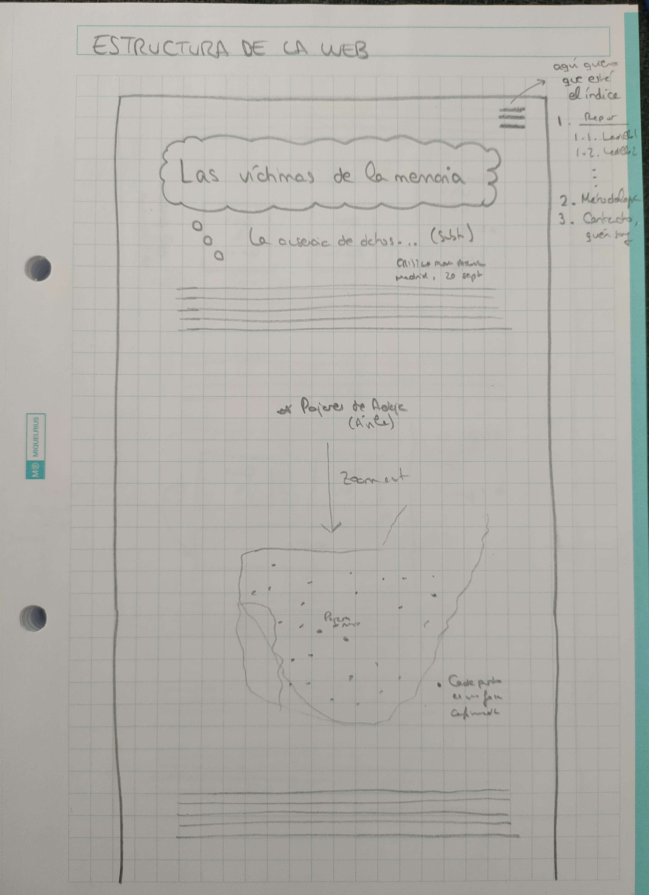
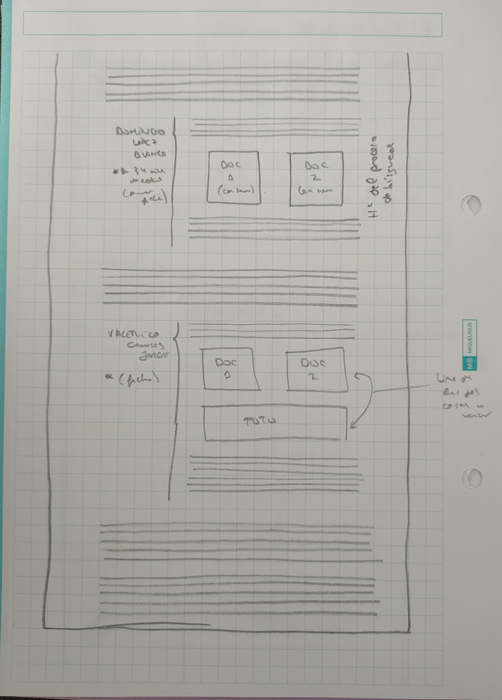

# Metodología del Trabajo Fin del Máster en Periodismo y Visualización de Datos (MPVD)
Alumna: Cristina Alonso Pascual 
Curso: 2022-2023

**Resumen**:

XXXXXXXXXXXXXXXXXXXXXXXXXXXXXXXXXXXXXXXXXXXXXXXX

**Palabras clave**: memoria histórica, memoria democrática, guerra civil, franquismo, recopilación de datos

---

**Abstract**:

XXXXXXXXXXXXXXXXXXXXXXXXXXXXXXXXXXXXXXXXXXXXXXXXXXX

**Keywords**: historical memory, democratic heritage, Spanish Civil War, Francoist dictatorship, data compilation

## 1. Introducción

La importancia de la memoria para el ser humano ha marcado la historia y la evolución de la humanidad. Esta relevancia queda patente a través de proyectos como *Memory of the World*, de la Organización de las Naciones Unidas para la Educación, la Ciencia y la Cultura [(UNESCO)](https://www.unesco.org/en/memory-world), que busca preservar la memoria documental y facilitar el acceso a la misma.

Sin embargo, esta práctica no es habitual en todas las ocasiones y existen momentos de la historia en los que es difícil acceder a toda la documentación, ya sea por falta de archivos, desinterés de la administración o de la población, o, incluso, intención directa de olvidar o de ocultar algunos datos con distintas finalidades.

En ese contexto surge este Trabajo Fin de Máster, cuando descubro que desconozco detalles sobre el pasado reciente del país en el que nací y resido, España. Es en el momento en el que acudo al Valle de Cuelgamuros -entonces llamado Valle de los Caídos- junto a algunos amigos de otros países cuando me doy cuenta de que allí falta información, la cual yo misma soy incapaz de completar ante mis compañeros cuando quiero explicarles qué pasó allí, pese a haberme formado en España.

De esta forma, el Trabajo Fin de Máster que aquí se encuentra resumido nace con objeto de descubrir los impactos que tiene sobre una sociedad la falta de información y de datos accesibles sobre su historia, en especial si es reciente y si una parte de su población considera que aún quedan ciertas heridas sin cerrar. 

## 2. Estado de la cuestión

Si bien a lo largo de los últimos años se han hecho avances en pos de la memoria democrática, como la Ley 20/2022, de 19 de octubre, de Memoria Democrática publicada en el Boletín Oficial del Estado [(BOE)](https://www.boe.es/eli/es/l/2022/10/19/20/con), el fin del franquismo con la muerte del dictador Francisco Franco en 1975 no vino acompañado de una reparación o de un proceso judicial a quienes participaron en la represión durante los casi cuarenta años de dictadura, como sí ocurrió, por ejemplo, en Argentina, con el [Juicio a las Juntas](https://www.argentina.gob.ar/noticias/juicio-las-juntas-la-primera-condena-al-terrorismo-de-estado) de diciembre de 1985.

Así, el Gobierno de España ha iniciado finalmente la conversación sobre la memoria democrática a través de del cambio de nombre del Ministerio de la Presidencia, Relaciones con las Cortes y Memoria Democrática [(MPR)](https://www.mpr.gob.es/memoriademocratica/Paginas/index.aspx) y la inclusión de la Secretaría de Estado de Memoria Democrática. También ciertos medios de comunicación han creado secciones al respecto, como eldiario.es, que ha elegido [este tema](https://www.eldiario.es/focos/memoria_historica/) como uno de los "focos" del periódico.

Sin embargo, no existen numerosos artículos que analicen la dificultad de acceso a la información en memoria democrática -*Público* publicó el 31 de agosto de 2022 una pieza enfocada en ["La oscura realidad de los archivos militares en España"](https://www.publico.es/politica/oscura-realidad-archivos-militares-espana-falta-personal-gestionar-memoria.html)-, y es aún más complicado encontrar algún artículo o reportaje que desglose cuáles son los pasos a seguir para encontrar datos sobre personas asesinadas o represaliadas durante el franquismo y la guerra civil española, junto a las consecuencias que esto supone no solo para los familiares sino también para el conjunto de la sociedad.

Con el fin de cubrir este espacio, surge este Trabajo Fin de Máster.

## 3. Metodología

### 3.1. Origen de la investigación

El proceso de este Trabajo Fin de Máster del MPVD se inicia el 5 de diciembre de 2022. Tras una charla de Emilio Silva, sociólogo y activista por la recuperación de la memoria histórica, en el máster, mi interés sobre el tema se incrementa y me doy cuenta de que puedo darle una salida a través del máster.

Esta intención se afianza con la charla del 24 de febrero de 2023 de Concha Catalán, aunque el proceso de decisión no termina hasta agosto de ese mismo año. Es a finales de ese mes cuando me planteo cuál va a ser el enfoque del Trabajo Fin de Máster, ya que el concepto de memoria histórica es muy amplio y se ha escrito bastante sobre el tema. 

Finalmente, decido que, para relacionarlo con el máster y poder usar las herramientas aprendidas durante el mismo para generar un fin de servicio, quiero hablar sobre lo que supone la falta de datos o la dificultad de acceso a los mismos en este tema, algo que creo que incluso puede llegar a marcar la historia de un país y las relaciones entre sus habitantes, si bien esta hipótesis es algo que se tratará de resolver durante el desarrollo del reportaje.

### 3.2. Fuentes personales utilizadas

Así, al comenzar el mes de septiembre, me pongo en contacto con las personas que me gustaría entrevistar:

- Emilio Silva, sociólogo y activista por la recuperación de la memoria histórica.
- Concha Catalán, periodista y fundadora de la web Innovation and Human Rights [(IHR)](https://ihr.world/es/), con datos referenciados sobre la guerra civil y el franquismo.
- Javier Ruiz, miembro de la Asociación Foro por la Memoria Democrática.
- Jorge Moreno, antropólogo y director del proyecto *Mapas de Memoria*.
- Manuela Bergerot, diputada y secretaria de Organización de Más Madrid, experta en Memoria Democrática.

Consigo hablar con todos, salvo con Bergerot y Ruiz. A su vez, Emilio Silva me pone en contacto con Hernán Fernández-Barriales, autor de la web [buscar.combatientes.es](https://buscar.combatientes.es/). 

Además, después de la conversación con Jorge Moreno, contacto con otras tres personas que él me recomienda:

- Francisco Ferrándiz, antropólogo del Consejo Superior de Investigaciones Científicas (CSIC).
- Francisco Etxeberria, antropólogo forense que ha colaborado con distintas asociaciones de Memoria Histórica en más de un centenar de exhumaciones en España.
- Fausto Canales, hijo de Valerico Canales, víctima del franquismo en 1936 en Pajares de Adaja (Ávila).

Con ellos decido concluir mi búsqueda de fuentes y cerrar el reportaje, si bien solo obtengo respuesta por parte de Fausto Canales, con quien quedo de forma presencial, y de Francisco Etxeberria, a quien remito una serie de preguntas por correo.

El resto de entrevistas se realizan de forma telefónica, salvo la de Fernández, que se hace mediante videollamada. Todas ellas se graban y se minutan para luego facilitar la transcripción de las declaraciones, procedentes finalmente de un total de cinco fuentes.

[OJO REVISAR CUÁNTAS HAN SIDO LAS FUENTES PERSONALES FINALMENTE]

XXXXXXXXXXXXXXXXXXXXXXXXXXXXXXXXXXXXXXXXXXXXXXXXXXXXX

### 3.3. Fuentes documentales utilizadas

[AÑADIR FUENTES DOCUMENTALES UTILIZADAS DURANTE EL PROCESO]

### 3.4. Desarrollo del reportaje

Una vez recopilada la distinta información -aunque alguna se va añadiendo durante el propio proceso de redacción-, se utilizan herramientas de transcripción de audio a texto (Pinpoint, de Google) para facilitar el trabajo de escucha y selección de declaraciones de las fuentes personales utilizadas.

Así, comienza la redacción del reportaje, durante la que se lleva a cabo un proceso de estructura de la información que luego se mostrará en una web, desarrollada de forma simultánea a la escritura y finalizada posteriormente.

### 3.5. Desarrollo de la web

Una vez finalizado el reportaje incluyendo la estructura del mismo, se inicia el desarrollo de la web la penúltima semana de septiembre.

Primero, se bosqueja la forma de organización prevista para la web, basada en las entrevistas y antes de finalizar la redacción del reportaje.

En las imágenes anteriores, se precisa cuál es la idea inicial de la web, que se basa en título y subtítulo seguido del cuerpo principal del texto, con un mapa de las fosas y, posteriormente, visualizaciones de las fichas de las dos víctimas acerca de las que se han realizado las entrevistas, para ejemplificar el enfoque del texto.

Es decir, aunque el enfoque del cuerpo principal del Trabajo Fin de Máster es la ausencia de datos y será lo que se desarrolle a lo largo de este, las fichas complementarán el reportaje con anécdotas concretas para quienes quieran más detalles.

#### 3.5.1. Herramientas utilizadas en la web

XXXXXXXXXXXXXXXXXXXXXXXXXXXXXXXXXXXXXXXXXXXXXXXXXX

#### 3.5.2. Diseño de la web

XXXXXXXXXXXXXXXXXXXXXXXXXXXXXXXXXXXXXXXXXXXXXXXXXX

## 4. Conclusión

[AÑADIR CONCLUSIONES DEL TFM Y SUS LIMITACIONES O COSAS QUE FALTAN POR TRATAR O ESTARÍA BIEN COMPLETAR CON FUTUROS REPORTAJES O ARTÍCULOS]

XXXXXXXXXXXXXXXXXXXXXXXXXXXXXXXXXXXXXXXXX

## 5. Bibliografía y referencias

*Por orden de aparición*

- *Memory of the World*, Organización de las Naciones Unidas para la Educación, la Ciencia y la Cultura (UNESCO). Enlace: https://www.unesco.org/en/memory-world. Consultado el 23 de septiembre de 2023.
- *Ley 20/2022, de 19 de octubre, de Memoria Democrática*, Boletín Oficial del Estado (BOE). Enlace: https://www.boe.es/eli/es/l/2022/10/19/20/con. Consultado el 23 de septiembre de 2023.
- *Juicio a las Juntas: la primera condena al terrorismo de Estado*, Ministerio de Justicia y Derechos Humanos del Gobierno de Argentina, publicado el 9 de diciembre de 2021. Enlace: https://www.argentina.gob.ar/noticias/juicio-las-juntas-la-primera-condena-al-terrorismo-de-estado. Consultado el 23 de septiembre de 2023.
- Página web de memoria democrática, Ministerio de la Presidencia, Relaciones con las Cortes y Memoria Democrática (MPR). Enlace: https://www.mpr.gob.es/memoriademocratica/Paginas/index.aspx. Consultado el 23 de septiembre de 2023.
- Sección de memoria histórica, *eldiario.es*. Enlace: https://www.eldiario.es/focos/memoria_historica/. Consultado el 23 de septiembre de 2023.
-"La oscura realidad de los archivos militares en España: falta personal para gestionar tanta memoria", *Público*. Enlace: https://www.publico.es/politica/oscura-realidad-archivos-militares-espana-falta-personal-gestionar-memoria.html. Consultado el 23 de septiembre de 2023.
- Innovation and Human Rights (IHR), Concha Catalán. Enlace: https://ihr.world/es/. Consultado el 23 de septiembre de 2023.
- buscar.combatientes.es, Hernán Fernández. Enlace: https://buscar.combatientes.es/. Consultado el 23 de septiembre de 2023.
